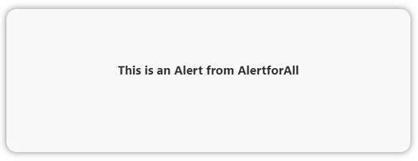
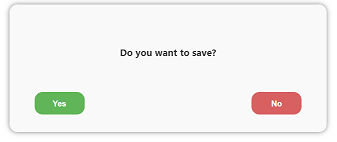
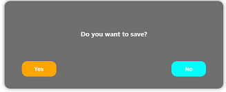
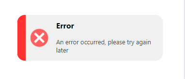

#### Version : 1.0.2

[Github](https://github.com/Giacomo90/AlertforAll)

[BUG or INFO](https://github.com/Giacomo90/AlertforAll/issues)


#### <font color="olive"> AlertforAll is a very lightweight library compatible with many javascript and typescript frameworks. </font>

## Installation

###### USING NPM:
```bash
$ npm install alertforall
```
###### USING YARN:
```bash
 $ yarn add alertforall
```

 ## Starting

After installing the module as described above, you need to import it to your project.


```javascript
import AlertforAll,{Alert,Toast} from 'alertforalll'
```

```javascript
const AlertforAll = require('alertforall') 
```


### example

 here is an example to show an alert with automatic closure


```javascript
  import {Alert} from 'alertforall'

  Alert.type1({TitleMsg:'This is an Alert from AlertforAll'})
```


or

```javascript
  import {Alert} from 'alertforall'

  Alert.type1({TitleMsg:'Do you want to save?', Btn_Confirm:'Yes', Btn_Cancel:'No'})
```



######  You can also call the function directly to perform some configurations

```javascript
import AlertforAll from 'alertforall'

const setting = {
  isDark:true,
  buttonConfirmColor:'orange',
  buttonCancelColor:'aqua'
}

const Alert= AlertforAll(setting)

Alert.type1({TitleMsg:'Do you want to save?', Btn_Confirm:'Yes', Btn_Cancel:'No'})
```
Promises for slightly more advanced codes are also accepted.

```javascript
AlertforAll(setting).type1({TitleMsg:'Do you want to save?', Btn_Confirm:'Yes', Btn_Cancel:'No'})
.then((response)=>{console.log(response)})
.catch((error)=>{console.log(response)})
```

Promises are currently only available for Alert types, and return boolean values ​​or strings as per type4.





#### Toast


In addition to the Alerts we also show some very useful Toasts for mobile devices

```javascript
import AlertforAll,{Toast} from 'alertforall'

AlertforAll(Setting).frame2({TitleMsg:'An error occurred, please try again later',Ico:'Error'})
```
alternative
```javascript
import AlertforAll,{Toast} from 'alertforall'

Toast.frame2({TitleMsg:'An error occurred, please try again later',Ico:'Error'})
```
Toasts still don't accept promises




## The different forms


| NAME|CALL METHOD|ACCEPTED VALUES|REQUIRED| 
| ------ | :------: | :------: | ---|
| **type1()** | Alert.type1() or AlertforAll().type1() |**TitleMsg**:string <br> **Btn_Confirm**:string <br> **Btn_Cancel**:string| **TitleMsg**: required <br> **Btn_Confirm & Btn_Cancel**: not necessary, if not present the default 3s automatic closing is activated.
| **type2()** | Alert.type2() or AlertforAll().type2() |**TitleMsg**:string <br>**Btn_Cancel**:string <br>**TextMsg**:string|**TitleMsg**: required <br> **Btn_Cancel**: not necessary, if not present the default 3s automatic closing is activated.<br> **TextMsg**:not necessary
| **type3()** | Alert.type3() or AlertforAll().type3() |**TitleMsg**:string <br>**Btn_Cancel**:string <br>**TextMsg**:string <br> **Ico**: 'Success','Error','Warning','Info','Question'|**TitleMsg**: required <br> **Btn_Cancel**: not necessary, if not present the default 3s automatic closing is activated.<br> **TextMsg**:not necessary<br> **Ico**:not neccessary, default 'success'
| **type4()** | Alert.type4() or AlertforAll().type4() |**TitleMsg**:string <br>**Btn_Cancel**:string <br>  **restriction**:array of string <br> **obliged**:array of string <br> **type**:'text','textarea','password', 'username','telephone','url','search'|**TitleMsg**: required <br> **Btn_Cancel**: required, <br> **restriction**:not necessary **obliged**:not necessary <br> **type**:not necessary,default 'text'
| **frame1()** | Toast.frame1() or AlertforAll().frame1() |**TitleMsg**:string |**TitleMsg**: required <br>
| **frame2()** | Toast.frame2() or AlertforAll().frame2() |**TitleMsg**:string <br> **Ico**:'Success','Error','Warning','Info' |**TitleMsg**: required <br> **Ico**:not neccessary, default 'Success'


## The various settings

| NAME SETT|CALL METHOD|ACCEPTED VALUES|DEFAULT| 
| ------ | :------: | :------: | ---|
|**delay**|type1() type2() type3() frame1() frame2() | Number ms | 3000
|**isDark**|type1() type2() type3() type4() frame1() frame2() | Boolean | false
|**position**|type1() type2() type3() type4() | 'top','center',bottom' | 'top'
|**color** |type1() type2() type3() type4() frame1() | hex value '#000' |'#eee' or '#333'|
|**textCancelColor**| type1() type2() type3() type4() | hex value '#000'| #fff
|**textConfirmColor**| type1() | hex value '#000'| #fff
|**buttonConfirmColor**| type1() |hex value '#000' |#60b558
|**buttonCancelColor**| type1() type2() type3() type4() | hex value '#000 |#d86060
|**positionHorizontal** <br> **positionVertical** | frame1() frame2() |'start''center''end' | 'center <br> 'end' 
|**fontSize**| frame1() frame2() | string px '12px' | '14px'
|**fontWeight**|frame1() frame2()| string number '600' | '500'

```javascript

const object={
 delay:5000, // number-default 3000(3s)
 isDark:false, // boolean-default false
 position:'top', // 'top''center''bottom'-default 'center' 
 ... 
}

AlertforAll(object).prototype()  // with changes applied

AlertforAll().prototype() // standard without modifications
```


#### <font color="green"> Library written by Giacomo Mattina. <br> First released version 6/29/2024 </font>
